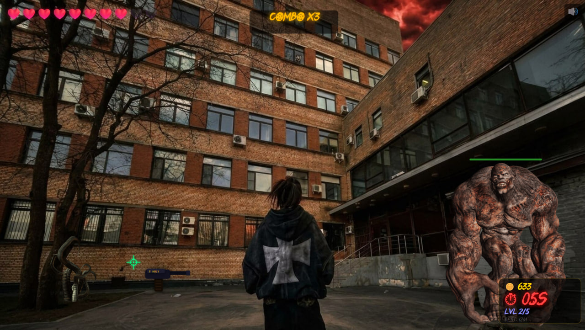

# Holy Hunter

Браузерный canvas-шутер с хоррор-атмосферой, монстрами, уровнями, комбо, магазином, звуками и мобильной адаптацией.

Игра сделана на чистом HTML/CSS/JavaScript без фреймворков и сборки. Открывается как обычная статическая страница и деплоится через GitHub Pages.

## Демо

[Играть в браузере](https://xznex.github.io/holly-hunter/)

| Геймплей |
| --- |
|  |

## Что есть в игре

- 5 уровней с нарастающей сложностью.
- 3 типа врагов: монстры в окнах, щупальца и большой монстр.
- Стрельба по клику или тапу.
- HP игрока и урон, если монстры успевают уйти.
- Комбо-система с множителем монет.
- Монеты и магазин между уровнями.
- Баффы: лечение, двойной урон, замедление врагов.
- Экран победы и game over.
- Фоновая музыка, эффекты выстрелов, звуки врагов и голосовые реплики.

## Реализация

Проект собран в одном `index.html`:

- `Canvas 2D` отвечает за весь рендер;
- `requestAnimationFrame` используется для игрового цикла;
- игровые координаты фиксированы в `1920x1080`;
- состояния игры: `menu`, `playing`, `paused`, `shop`, `gameover`, `win`;
- логика разделена на классы `Game`, `LevelManager`, `Monster`, `Weapon`, `SoundManager`, `UI`, `Particle`;
- рекорд сохраняется в `localStorage`;
- звуки работают через Web Audio API с fallback на обычный `Audio`.

## Мобильная адаптация

Игра отдельно оптимизирована под телефоны:

- сниженное внутреннее разрешение canvas на мобильных;
- отдельный мобильный баланс уровней;
- меньше частиц и тяжелых эффектов;
- отключены погодные эффекты на мобильных;
- быстрый `touchstart`-ввод для выстрелов;
- поддержка `visualViewport` и `viewport-fit=cover`;
- адаптация под iPhone Safari и Android Chrome.

## Стек

- HTML
- CSS
- JavaScript
- Canvas 2D
- Web Audio API
- GitHub Pages

## Структура

```text
index.html                  # игра, стили и логика
images/                     # фоны, враги, экраны победы/game over
sounds/                     # музыка, эффекты и voice lines
fonts/                      # игровые шрифты
```
